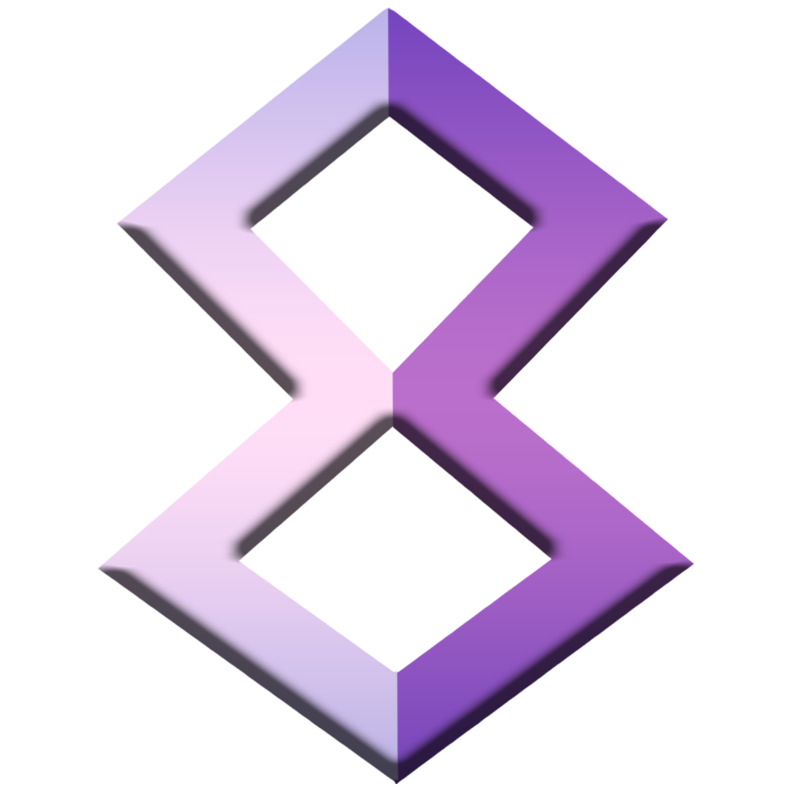
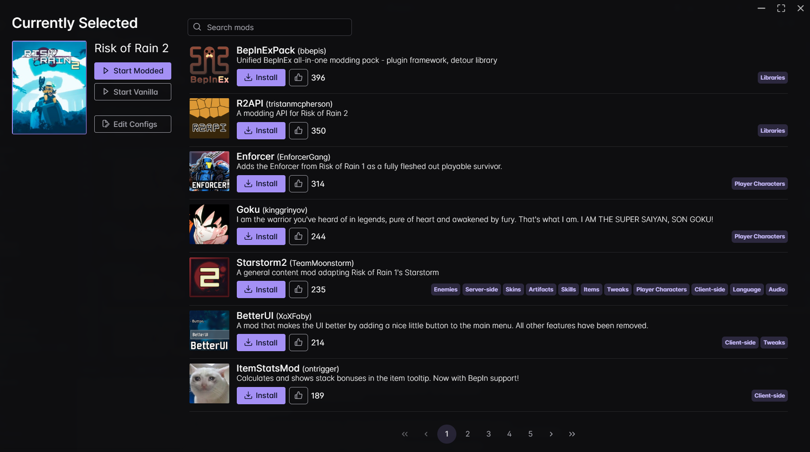
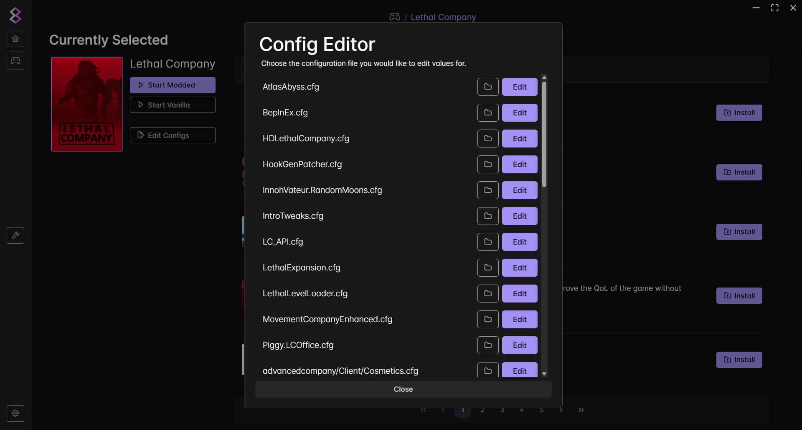
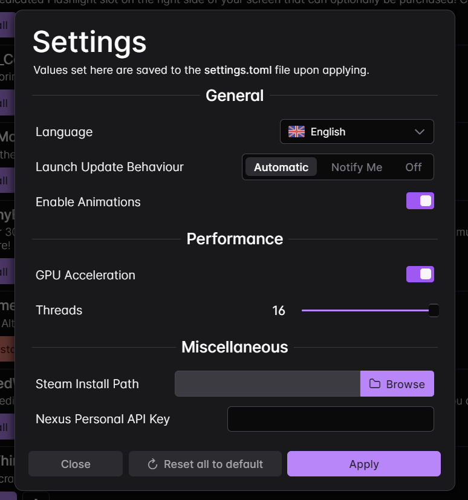

# modm8 

Lightweight and intuitive mod manager with support for [Thunderstore](https://thunderstore.io) and [Nexus Mods](https://nexusmods.com).\
Built with [Wails](https://wails.io) for an Electron-like experience but without the bloat.

> [!NOTE]
> This project is heavily **WIP** and as such, missing functionality or bugs will be commonplace until there is a stable release.
> Once officially released, a proper FOSS license will be added. Meanwhile, there is no license, meaning all rights are reserved.
>
> Until a release is ready, please build from source. PRs and contributions are very much welcome!

## Installation
1. Head to the [latest release](../../releases/latest) page and find the correct installer for your platform.
2. Download and run it, then continue with the setup process.

## Features
- Multiple themes + dark mode by default.
- Go as the backend for concurrency and responsiveness.
- No browser bundled, uses native browser to render content.
- App settings can be easily changed. No need to go through unnecessary menus.
- Familiar frontend. Similar to existing apps like `r2modman`.
- Supports multiple languages with the help of `vue-i18n`.
  - Currently implemented: **English**, **German**, **French**, **Spanish**, **Italian**
  - Language PRs are greatly appreciated as some keys may have been wrongly translated!

## Roadmap
🟩 Completed / Released.\
🟨 In progress / Waiting release.\
🟥 Not started / Evaluating.

- Handy features for mod developers. (Publishing, validation etc.)\
  🟨 Backend\
  🟥 Frontend

## Showcase

  
Game Selection

  - Useful buttons and insightful info layed out in a sleek and compact manner.
  - Flexible query matching ensures you can search for a game without being exact.
  - Filter by your favourite or installed games - no more tedious searching.
  - Switch between List and Grid layouts for a better viewing experience.

  

  
Selected Game Screen

  

  
Config Editor

  

  
Settings

  

## Contact
Feel free to join the [discord](https://discord.gg/psBXpXF2JZ) for support, suggestions or anything mod related!
