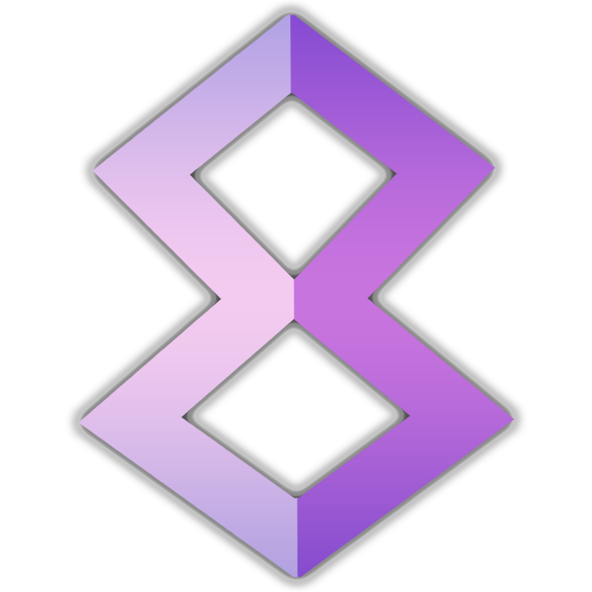
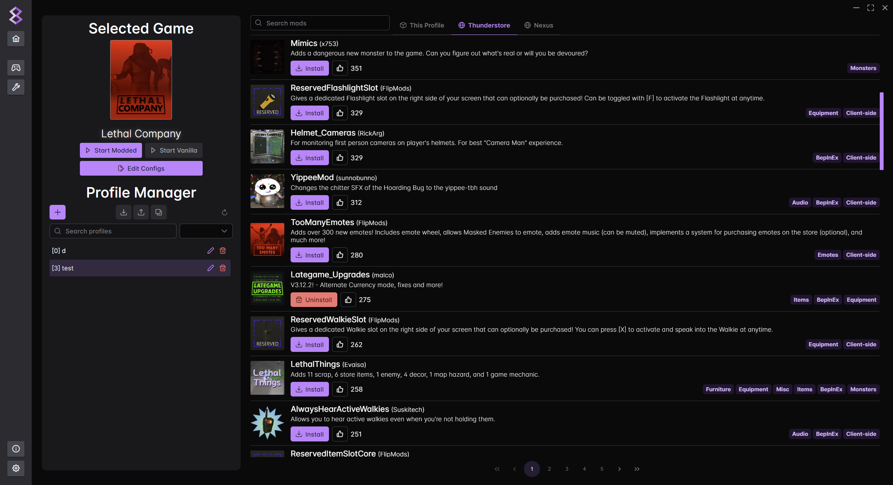

# modm8 

Lightweight and intuitive mod manager with support for [Thunderstore](https://thunderstore.io) and [Nexus Mods](https://nexusmods.com).\
Built with [Wails](https://wails.io) for an Electron-like experience but without the bloat.

> [!NOTE]
> This project is heavily **WIP** and as such, missing functionality or bugs will be commonplace until there is a stable release.
> Once officially released, a proper FOSS license will be added. Meanwhile, there is no license, meaning all rights are reserved.
>
> Until a release is ready, please build from source. PRs and contributions are very much welcome!

  
View Showcase

  ### Game Selection
  

  ### Current Game Screen
  

  ### Config Editor
  

  ### Settings
  

## Features
- Multiple themes + dark mode by default.
- Go as the backend for concurrency and responsiveness.
- No browser bundled, uses native browser to render content.
- App settings can be easily changed. No need to go through unnecessary menus.
- Includes handy features for mod developers. (Publishing, validation etc.)
- Familiar frontend. Similar to existing apps like `r2modman`.
- Supports multiple languages with the help of `vue-i18n`.
  - Currently implemented: **English**, **German**, **French**, **Spanish**, **Italian**
  - Language PRs are greatly appreciated as some keys may have been wrongly translated!

## Installation
1. Head to the [latest release](../../releases/latest) page.
2. Find and download the correct installer for your platform.
3. Run the installer and continue with the setup.

## Contact
Feel free to join the [discord](https://discord.gg/psBXpXF2JZ) for support, suggestions or anything mod related!
