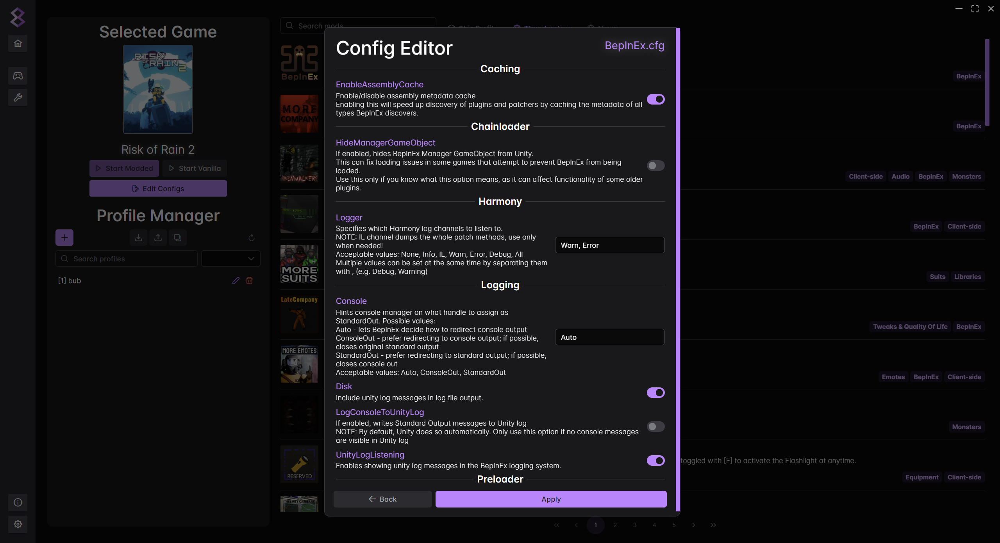

# modm8 
A mod manager for the modern age. Fast ✅ Intuitive ✅ Ad-free ✅ Multiple languages ✅\
Built with [Wails](https://wails.io) for an Electron-like experience but without the bloat.

> [!WARNING]
> This project is heavily **WIP** and as such, missing functionality or bugs will be commonplace until there is a stable release.
> Once officially released, a proper FOSS license will be added. Meanwhile, there is no license, meaning all rights are reserved.
>
> **CURRENT STATUS:** Unusable

## Installation
No installer or executable currently exists yet, please build from source instead.

1. Clone this repository.
2. Install [Go](https://go.dev/doc/install), [Bun](https://bun.sh) and [Wails](https://wails.io/docs/gettingstarted/installation).
3. Run one of the following commands:
   - `wails build` - Generates an executable in **/build/bin**.
   - `wails dev` - Opens a preview of the app with DevTools enabled.

## Features
- Multiple themes + dark mode by default.
- Go as the backend for concurrency and responsiveness.
- No browser bundled, uses native browser to render content.
- App settings can be easily changed. No need to go through unnecessary menus.
- Familiar frontend. Similar to existing apps like `r2modman`.
- Supports multiple languages with the help of `vue-i18n`.
  - Currently implemented: **English**, **German**, **French**, **Spanish**, **Italian**
  - Language PRs are greatly appreciated as some keys may have been wrongly translated!

## Showcase

  
Game Selection

  - Useful buttons and insightful info layed out in a sleek and compact manner.
  - Flexible query matching ensures you can search for a game without being exact.
  - Filter by your favourite or installed games - no more tedious searching.
  - Switch between List and Grid layouts for a better viewing experience.

  

  
Selected Game Screen

  

  
Config Editor

  

  
Settings

  

## Contributing
Pull requests and issues are very much welcome and are essential to keeping this project working and evolving!\
All I ask is you follow some simple guidelines to maintain a healthy, productive environment.

- Please be polite and keep critisicm toward the project and other contributors constructive.
- Provide as much detail as possible so the issue or idea can be easily understood.
- Bumping/rushing an issue does not help and only creates unnecessary notifications, please be patient.
- Promptly address any CI failures, a maintainer is not obliged to do this for you.

A lot of time and effort has been put into this project as a single person.\
If you find it useful or like where it's headed, please consider sponsoring it. 💛

## Contact
Feel free to join the [discord](https://discord.gg/psBXpXF2JZ) to contact me! Here you will get to:

- See first-hand updates about the project and its progress.
- Chat about the project's development or anything mod related.
- Suggest ideas and get support if you are stuck.
- View the **TODO** list to see what needs fixing/implementing and if it's being currently worked on.
